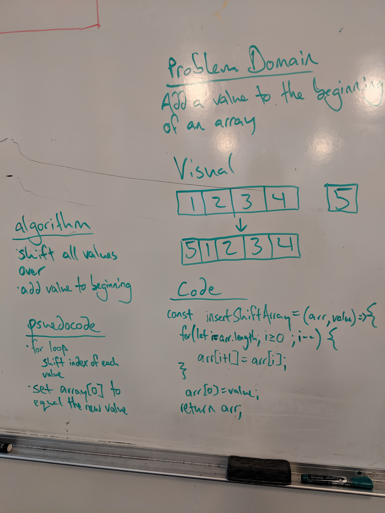

# Reverse an Array
Coding challenge #2

## Challenge
The challenge is to take an array and add a number to the beginning of the array and shift all the values over.

## Approach & Efficiency 
I used a for loop that ran through half the array. During each iteration, I swapped the current index with it's opposite towards the other end of the array. The result is a reversed array.

## Solution
