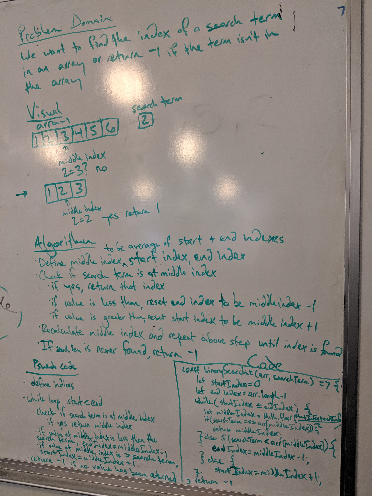

# Binary Array Search
Coding challenge #3

## Challenge
The challenge is to take an array and a search term and return the index of that term in the array. If the term isn't in the array we should return -1.

## Approach & Efficiency 
I used a while loop while the start index was less than the end index. During each iteration, it checked if the middle index contained the search term. If it didn't, it changed the start or end index accordingly for the next iteration. If nothing was returned from the while loop, the function returns -1.

## Solution
