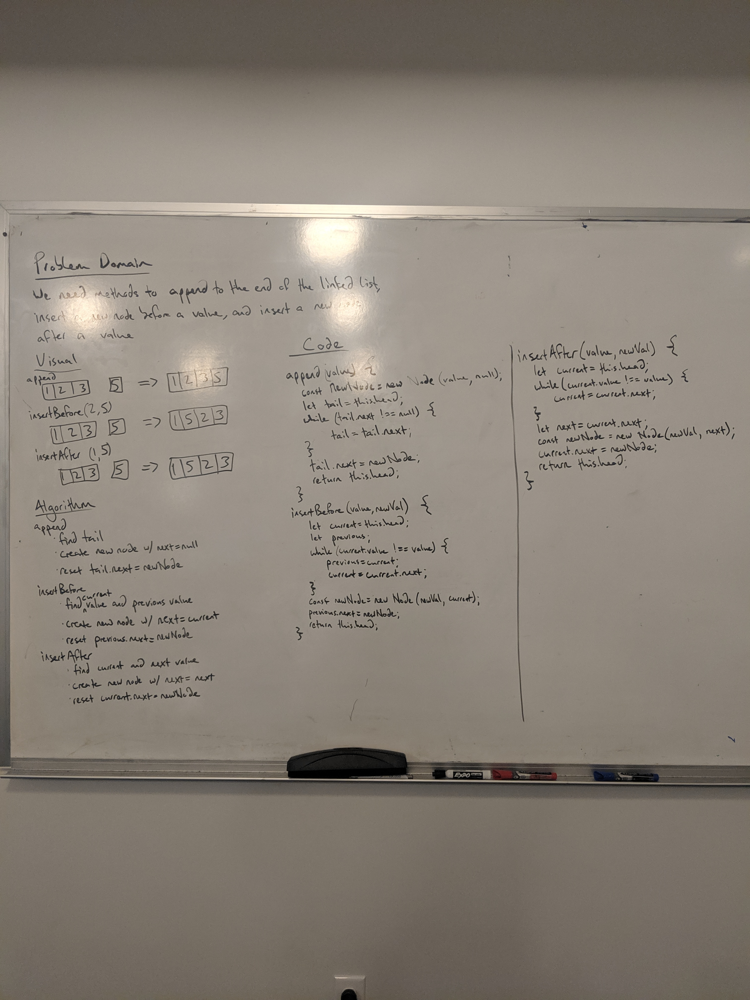

# Reverse an Array
Coding challenge #4 and #5

## Challenge
The challenge for #4 is to create a linked list with methods to add a node to the beginning, check if a value is in the list, and return all the values in the list as a string. #5 challenges include adding methods to append to the end of the linked list, insert a node before a value, and insert a node after a value.

## Approach & Efficiency 
For inserting a new node, I created a new node and reset the head to be that node. For includes, I looped through the linked list and checked if the value matched the inputted value. For toString, I looped through the linked list and added each value to an array that I then called .join on. For append, I looped through to find the tail then reset its next to be the new node. For insertBefore, I looped through to find the value and its previous node, setting the next of the previous node to the new node. For insertAfter, I looped through to find the value and its next node, setting the next of the value to be the new node.

## Solution

