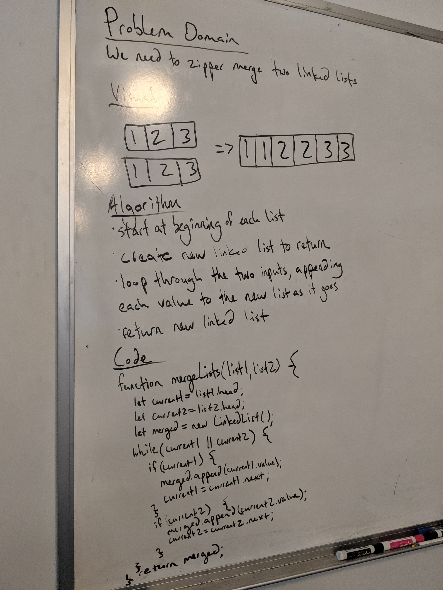

# Reverse an Array
Coding challenge #7

## Challenge
The challenge is to create a function that zipper merges two linked lists

## Approach & Efficiency 
I created a new linked list, then looped through the original two linked lists, appending each value to the new list as I went.

## Solution
